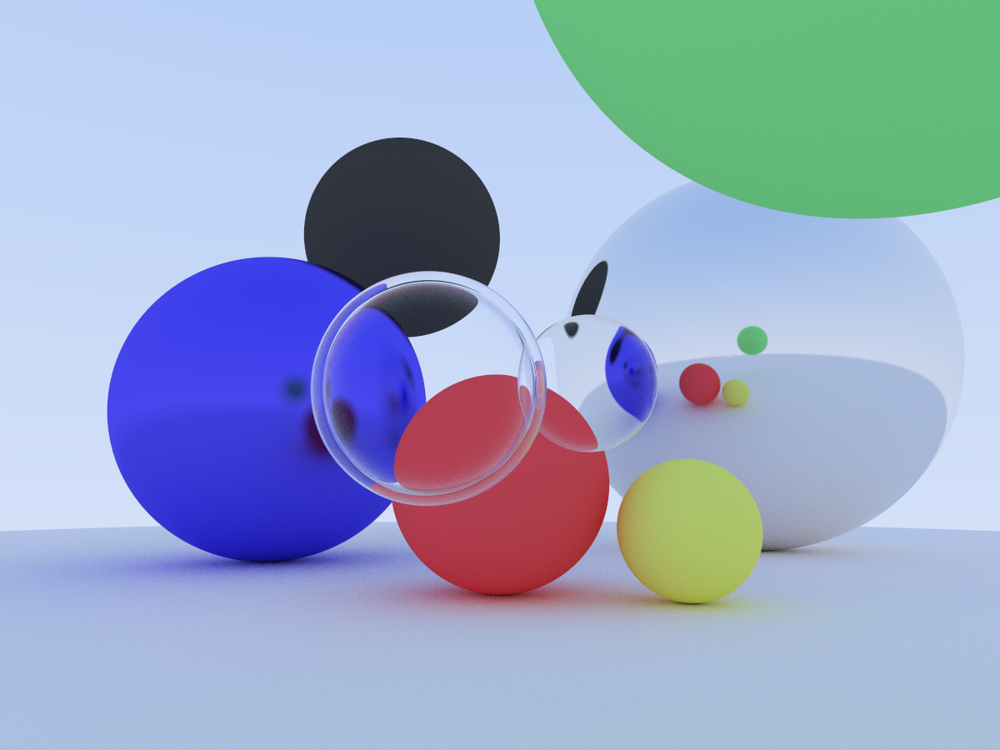
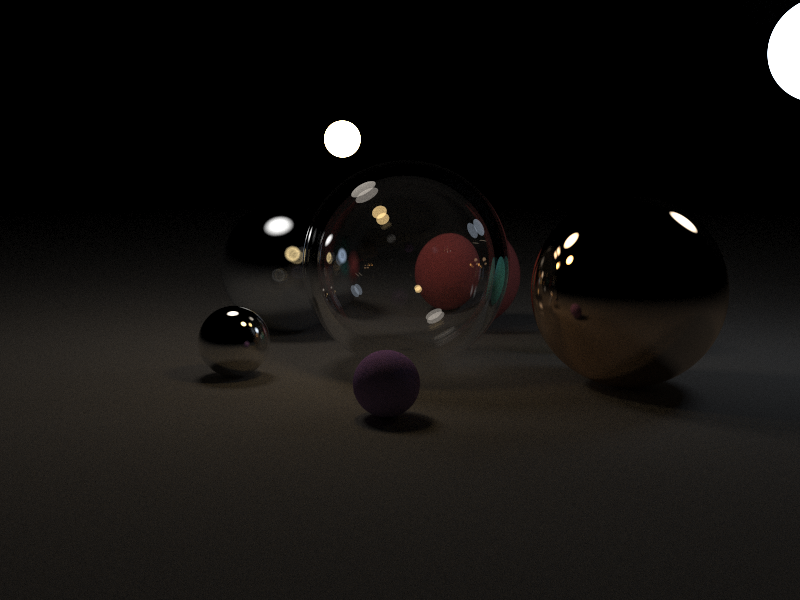

## Ray Tracer in Rust

A learning project to implement the Ray Tracing book in Rust.

Followed the [Ray Tracing in One Weekend](https://raytracing.github.io/books/RayTracingInOneWeekend.html) (first book) and implemented it in a few days. I've done some of the things in C# on my first time reading the book. But then I ported it to Rust and fully finished the first book.

I wrote all the ray tracing code myself, but I had Claude help me with the interactive stuff and UI (egui). The focus of the project was to understand ray tracing concepts and try out Rust. The UI is just a way to explore things in a more interactive way.

### TODO

Excluding the stuff from the next 2 books:

- Make the skybox settings also configurable in the sidebar
- Fly around camera with WASD and mouse
- Responsive image size that fills the canvas
- Refactor the materials to be a single type (PBR) with all parameters at once like rougness, metallic, emission etc.
- GPU rendering with shaders (wgpu?)
